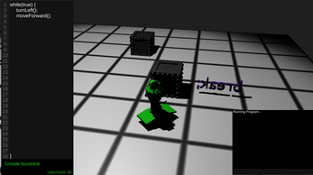
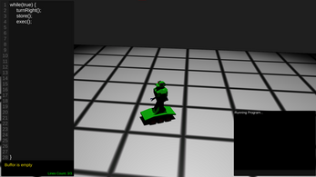
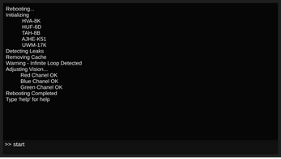

# While(true) - A Gamejam Adventure

## Welcome
Welcome to While(true), an innovative game developed during a gamejam! In While(true), you'll embark on a coding adventure where you must program a robot to reach the 'break' function and execute it. But beware, you have limited lines of code to use, so you'll need to cleverly utilize the infinite loop you find yourself in.

## Download
You can download the game from the following link: [While(true) Download](https://damianbxp.itch.io/whiletrue)

## Gameplay
In While(true), you'll be faced with various challenges and puzzles that require programming skills to overcome. Your task is to guide the robot through each level by writing code that navigates through obstacles, collects resources, and ultimately reaches the 'break' function. But remember, you have limited lines of code available, so every line counts!

## Features
- Unique coding-based gameplay.
- Limited lines of code, requiring strategic thinking and optimization.
- Challenging puzzles and obstacles to overcome.
- Intuitive level design with increasing difficulty.
- Engaging storyline that unfolds as you progress through the game.

## How to Play
1. Download and install While(true) from the provided link.
2. Launch the game and begin your coding adventure.
3. Use the provided coding interface to write code for the robot.
4. Navigate through each level, overcoming obstacles and challenges.
5. Reach the 'break' function and execute it to advance to the next level.
6. Use your limited lines of code wisely to maximize efficiency.

